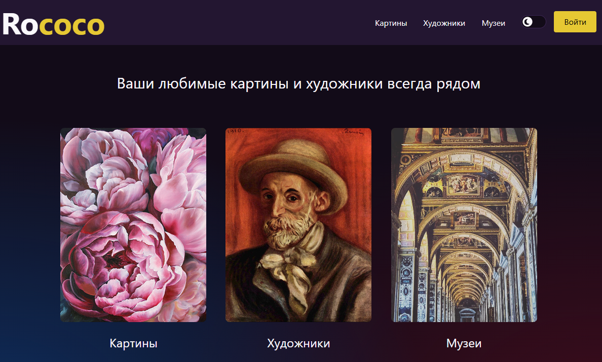
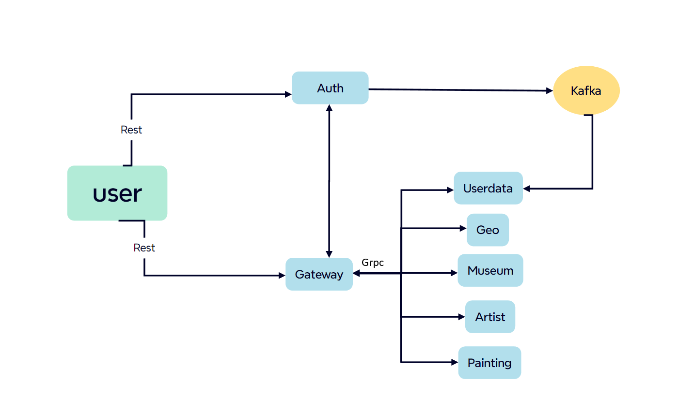
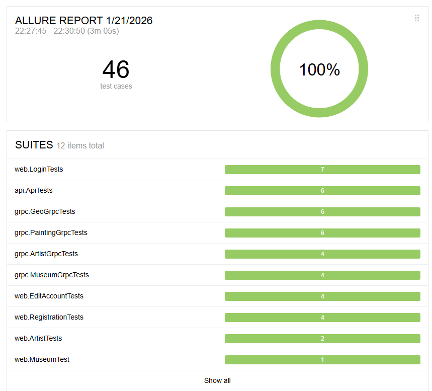

# Rococo

 Rococo -  стиль в искусстве и живописи, а теперь ещё и ресурс предназначенный для изучения галлерей, авторов, а также
представленных картин, хранящихся среди стен тех же галлерей




## Основной стэк
- Java 21
- JUnit 5 (Extensions, Resolvers, etc)
- MySQL
- Selenide
- Gradle
- Spring Authorization Server
- Spring OAuth 2.0 Resource Server
- Spring data JPA
- Spring Web
- Spring actuator
- Spring gRPC
- Apache Kafka
- Docker
- Docker-compose


## Сервис Rococo реализован с помощью микросервисной архитектуры:

- auth - аутентификация и авторизация
- gateway - обработка запросов клиента и вызов нужных микросервисов
- userdata - информация о пользователе: юзернейм, имя и фамилия, аватар
- geo - данные о странах мира
- museum - сведения о музеях
- artist - сведениях о художниках
- painting - сведениях о картинах
- frontend - интерфейс приложения, с которым взаимодействует пользователь



## Предусовия для работы с проектом Rococo
#### 1. Для Windows установлен Docker Desktop
#### 2. Установлена Java версии 21
#### 3. Установлена IDEA Community/Ultimate edition
#### 4.Установлен пакетный менеджер для сборки front-end npm [Инструкция](https://docs.npmjs.com/downloading-and-installing-node-js-and-npm)


## Шаги для локального развёртывания сервиса Rococo

#### 1.Спуллить контейнер mysql:8.3, zookeeper и kafka версии 7.3.2

```posh
docker pull mysql:8.3.0
docker pull confluentinc/cp-zookeeper:7.3.2
docker pull confluentinc/cp-kafka:7.3.2
```

#### 2. Создать volume для сохранения данных из БД в docker на вашем компьютере

```posh
docker volume create pgdata
```

#### 3. С помощью скрипта localenv.sh запустить БД, zookeeper, kafka и фронт сервиса 

```posh
bash localenv.sh
```

#### 4. Прописать run конфигурацию для сервисов rococo

- Для Idea Community:
Контекстное меню -> Run -> Edit Configurations -> выбрать main класс -> в поле Environment variables указать
spring.profiles.active=local

- Для Idea Ultimate:
Контекстное меню -> Run -> Edit Configurations -> для каждого сервиса, в поле Active Profiles ввести local

#### 5. В любой последовательности запустить все микросервисы


## Шаги для развёртывания сервиса Rococo в докере

#### 1. Создать volume для сохранения данных из БД в docker на вашем компьютере
```posh
docker volume create rococo-mysql
```

#### 2. Прописать в etc/hosts элиас для Docker

```posh
$ vi /etc/hosts
```

```posh
##
127.0.0.1       localhost
127.0.0.1       client.rococo.dc
127.0.0.1       auth.rococo.dc
127.0.0.1       gateway.rococo.dc
```

#### 3. Перейти в корневой каталог проекта

```posh
$ cd rococo
```

#### 4. Запустить все сервисы

```posh
bash docker-compose-dev.sh
```
Перейти к запущенному сервису можно по [ссылке](http://client.rococo.dc) 

## Результат работы автотестов:



## Прочее
- Окружение для запуска автотестов можно изменить, отредактировав параметр test.env в файле настроек 
rococo-e2e-tests/src/test/resources/at.properties
- При необходимости, images микросервисов можно найти в [репозитории](https://hub.docker.com/repositories/ililoz)